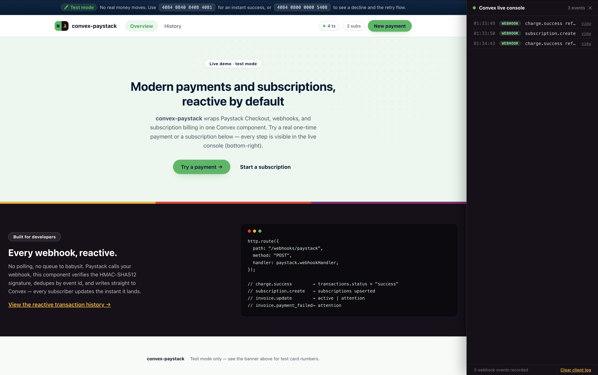

# convex-paystack

**Accept payments and subscriptions with Paystack in your Convex app.** Reactive transactions, subscription state, and webhook ingestion.

[](https://www.npmjs.com/package/convex-paystack)
[](https://www.convex.dev/components/convex-paystack)
[](https://www.npmjs.com/package/convex-paystack)
[](./LICENSE)



```ts
const paystack = new Paystack(components.convexPaystack, {
  secretKey: process.env.PAYSTACK_SECRET_KEY!,
});

// Start a checkout
const { authorizationUrl } = await paystack.initializeTransaction(ctx, {
  email: "customer@example.com",
  amount: 500000, // kobo
});

// Confirm it server-side after redirect
const result = await paystack.verifyTransaction(ctx, { reference });

// Is this customer on an active subscription?
const active = await paystack.hasActiveSubscription(ctx, { customerEmail: "customer@example.com" });
```

## What this does

Paystack fires webhook events every time a payment or subscription action happens — a charge succeeds, a subscription is created, an invoice is billed. Without this component, you have to write and maintain your own webhook receiver, HMAC signature verification, database schema, and reactive queries.

This component owns all of that. Drop it in, mount the webhook, and your Convex app immediately has:

- **Reactive transaction state** — every transaction, live in Convex, keyed by reference
- **Reactive subscription state** — subscription status, plan, next payment date, live in Convex
- **Checkout** — `initializeTransaction()` generates a Paystack-hosted checkout link for one-time payments or, with a `plan` code, for subscriptions
- **Plan management** — `createPlan()` / `listPlans()` manage the billing plans subscriptions are built on
- **Server-side verification** — `verifyTransaction()` confirms a transaction directly with Paystack
- **Subscription management** — `cancelSubscription()` / `enableSubscription()` call Paystack directly and keep local state in sync
- **Webhook idempotency** — duplicate deliveries of the same event are detected and skipped

> **Webhook timing:** After a payment or subscription action occurs in Paystack, there is a short delay — usually a few seconds — before the webhook arrives and your Convex data updates. Once the webhook arrives, Convex's real-time reactivity propagates the change to all subscribers instantly.

## Table of Contents

- [Install](#install)
- [Quick Start](#quick-start)
- [Setup](#setup)
- [Usage](#usage)
- [Checkout](#checkout)
- [Plans](#plans)
- [Subscriptions](#subscriptions)
- [API Reference](#api-reference)
- [Type Reference](#type-reference)
- [Webhook Events](#webhook-events)
- [Database Schema](#database-schema)
- [Customer IDs](#customer-ids)
- [Testing](#testing)
- [Example App](#example-app)
- [Limitations](#limitations)
- [Troubleshooting](#troubleshooting)
- [Contributing](#contributing)
- [Changelog](#changelog)

## Install

```bash
npm install convex-paystack
```

**Requirements:** Convex v1.34.1 or later, Node.js 18+, a [Paystack](https://paystack.com) account

## Quick Start

Five steps to add Paystack to your Convex app.

### 1. Add the component

In `convex/convex.config.ts`:

```ts
import { defineApp } from "convex/server";
import convexPaystack from "convex-paystack/convex.config";

const app = defineApp();
app.use(convexPaystack);

export default app;
```

### 2. Set environment variables

```bash
npx convex env set PAYSTACK_SECRET_KEY sk_live_xxxxxxxxxxxx
```

### 3. Mount the webhook handler

In `convex/http.ts`:

```ts
import { httpRouter } from "convex/server";
import { components } from "./_generated/api";
import { Paystack } from "convex-paystack";

const paystack = new Paystack(components.convexPaystack, {
  secretKey: process.env.PAYSTACK_SECRET_KEY!,
});

const http = httpRouter();

http.route({
  path: "/webhooks/paystack",
  method: "POST",
  handler: paystack.webhookHandler,
});

export default http;
```

### 4. Register the webhook in Paystack

1. In Paystack Dashboard → **Settings → API Keys & Webhooks**
2. Set the webhook URL: `https://your-deployment.convex.site/webhooks/paystack`
3. Save. Paystack sends every event to this URL — the handler ignores events it doesn't recognize.

Your Convex site URL is in the Convex dashboard under **Settings → URL & Deploy Key** — it ends in `.convex.site`.

### 5. Initialize the client

In `convex/payments.ts`:

```ts
import { components } from "./_generated/api";
import { Paystack } from "convex-paystack";

export const paystack = new Paystack(components.convexPaystack, {
  secretKey: process.env.PAYSTACK_SECRET_KEY!,
});
```

Import `paystack` from this file in any Convex function that needs payments.

## Setup

**`convex/payments.ts`** — your central payments module:

```ts
import { components } from "./_generated/api";
import { Paystack } from "convex-paystack";
import { action } from "./_generated/server";
import { v } from "convex/values";

export const paystack = new Paystack(components.convexPaystack, {
  secretKey: process.env.PAYSTACK_SECRET_KEY!,
});

export const checkout = action({
  args: { email: v.string(), amount: v.number() },
  handler: async (ctx, args) => paystack.initializeTransaction(ctx, args),
});
```

**`convex/http.ts`** — webhook entry point (shown in [Quick Start](#quick-start)).

## Usage

### Start a checkout

```ts
export const checkout = action({
  args: { email: v.string(), amount: v.number() },
  handler: async (ctx, args) => {
    return await paystack.initializeTransaction(ctx, {
      email: args.email,
      amount: args.amount, // subunit — kobo for NGN, pesewas for GHS, cents for USD
      callbackUrl: "https://yourapp.com/payment/callback",
    });
  },
});
// Returns: { authorizationUrl, accessCode, reference }
// Redirect the customer to authorizationUrl.
```

### Verify a transaction

```ts
export const confirmPayment = action({
  args: { reference: v.string() },
  handler: async (ctx, args) => {
    return await paystack.verifyTransaction(ctx, args);
  },
});
// Returns: { status, reference, amount, currency, channel, paidAt, customerEmail, ... }
```

### Read a transaction reactively

```ts
export const getTransaction = query({
  args: { reference: v.string() },
  handler: async (ctx, args) => {
    return await paystack.getTransaction(ctx, args);
  },
});
// Returns: Transaction | null
```

### List a customer's transactions

```ts
export const getHistory = query({
  args: { customerEmail: v.string() },
  handler: async (ctx, args) => {
    return await paystack.listTransactions(ctx, {
      customerEmail: args.customerEmail,
      limit: 20,
    });
  },
});
// Returns: Transaction[] ordered newest first
```

## Checkout

`initializeTransaction()` calls Paystack's [Initialize Transaction](https://paystack.com/docs/payments/accept-payments/) endpoint, records a `pending` transaction locally, and returns the hosted checkout URL. Send the customer to `authorizationUrl`; Paystack redirects them back to `callbackUrl` after payment.

Call `verifyTransaction()` from your callback route (or rely on the `charge.success` webhook) to confirm the final status — never trust the client-side redirect alone.

Two optional arguments shape what the customer sees at checkout:

- **`channels`** restricts which payment methods Paystack's hosted page offers — any of `"card"`, `"bank"`, `"apple_pay"`, `"ussd"`, `"qr"`, `"mobile_money"`, `"bank_transfer"`, `"eft"`, `"capitec_pay"`, `"payattitude"`. Omit it to let Paystack offer everything enabled on your account.
- **`plan`** turns a one-time checkout into a subscription — see [Plans](#plans).

```ts
await paystack.initializeTransaction(ctx, {
  email: "customer@example.com",
  amount: 500000,
  channels: ["card", "bank_transfer", "ussd"],
});
```

Pass `currency` to charge in something other than your account's default (Paystack test accounts are usually NGN-only until you enable more in **Dashboard → Settings → Preferences**). Rather than guessing, check what's actually enabled with `listBalances()`:

```ts
const balances = await paystack.listBalances(ctx);
// [{ currency: "NGN", balance: 0 }]
const enabledCurrencies = balances.map((b) => b.currency);
```

Charging a currency that isn't enabled throws `Currency not supported by merchant` — this component does not silently convert or substitute currencies for you.

## Plans

Plans are the billing schedule a subscription is built on — an amount, a currency, and an interval (`daily`, `weekly`, `monthly`, `quarterly`, `biannually`, `annually`). Create one, then pass its `planCode` to `initializeTransaction()`: the customer's first successful payment automatically starts the subscription, and this component records it as soon as the `subscription.create` webhook arrives.

```ts
export const createProPlan = action({
  args: {},
  handler: async (ctx) => {
    return await paystack.createPlan(ctx, {
      name: "Pro Monthly",
      amount: 500000, // ₦5,000.00 in kobo
      interval: "monthly",
      currency: "NGN",
    });
  },
});
// Returns: { planCode, name, amount, interval, currency, description? }

export const startSubscription = action({
  args: { email: v.string(), planCode: v.string(), amount: v.number() },
  handler: async (ctx, args) => {
    return await paystack.initializeTransaction(ctx, {
      email: args.email,
      amount: args.amount,
      plan: args.planCode,
    });
  },
});
```

`listPlans()` returns every plan already created on your Paystack account, so you can check for an existing plan by name before creating a duplicate — this is exactly the pattern the [example app](#example-app) uses to bootstrap its demo plans on first run.

## Subscriptions

Once a plan exists, a subscription is created automatically the first time a customer pays through a checkout initialized with that `plan` code (see [Plans](#plans) above). This component mirrors subscription state reactively as webhooks arrive, and exposes cancel/enable:

```ts
export const cancelPlan = action({
  args: { code: v.string(), token: v.string() },
  handler: async (ctx, args) => {
    await paystack.cancelSubscription(ctx, args);
    return null;
  },
});
```

`code` and `token` are the subscription's `subscription_code` and `email_token`, both delivered on the `subscription.create` webhook and available via `getSubscription()`.

If a subscription isn't showing up locally, it's almost always a webhook that hasn't reached your deployment yet (a fresh Convex project whose webhook URL was never registered in Paystack, most commonly). `syncCustomerSubscriptions()` is a fallback for exactly that — it reads the customer's live subscriptions from Paystack's [Fetch Customer](https://paystack.com/docs/api/customer/#fetch) endpoint and upserts them, no webhook required:

```ts
export const syncSubscriptions = action({
  args: { email: v.string() },
  handler: async (ctx, args) => {
    return await paystack.syncCustomerSubscriptions(ctx, { email: args.email });
  },
});
// Returns: number of subscriptions synced
```

## API Reference

| Method | Kind | Description |
| --- | --- | --- |
| `initializeTransaction(ctx, args)` | action | Starts a Paystack checkout, returns the hosted payment link — pass `plan` to start a subscription |
| `verifyTransaction(ctx, args)` | action | Confirms a transaction's final status with Paystack |
| `createPlan(ctx, args)` | action | Creates a billing plan on Paystack |
| `listPlans(ctx)` | action | Lists every billing plan on your Paystack account |
| `cancelSubscription(ctx, args)` | action | Disables a subscription on Paystack and locally |
| `enableSubscription(ctx, args)` | action | Re-enables a non-renewing subscription |
| `getTransaction(ctx, args)` | query | Fetch one transaction by reference |
| `listTransactions(ctx, args)` | query | List a customer's transactions, newest first |
| `getSubscription(ctx, args)` | query | Fetch one subscription by subscription code |
| `listSubscriptions(ctx, args)` | query | List a customer's subscriptions |
| `hasActiveSubscription(ctx, args)` | query | `true` if the customer has an active or non-renewing subscription |
| `listRecentEvents(ctx, args?)` | query | Raw webhook event log, newest first — audit trail or a live console |
| `getStats(ctx)` | query | Aggregate transaction/subscription/event counts for a small dashboard |
| `listBalances(ctx)` | action | Currencies actually enabled on your Paystack account, with their available balance |
| `syncCustomerSubscriptions(ctx, args)` | action | Pulls a customer's subscriptions straight from Paystack and upserts them locally — a fallback for when the webhook hasn't arrived (or isn't registered) yet |

## Type Reference

```ts
type InitializeTransactionArgs = {
  email: string;
  amount: number;
  currency?: string;
  callbackUrl?: string;
  reference?: string;
  channels?: Array<
    | "card" | "bank" | "apple_pay" | "ussd" | "qr"
    | "mobile_money" | "bank_transfer" | "eft" | "capitec_pay" | "payattitude"
  >;
  plan?: string;
  metadata?: Record<string, unknown>;
};

type CreatePlanArgs = {
  name: string;
  amount: number;
  interval: "daily" | "weekly" | "monthly" | "quarterly" | "biannually" | "annually";
  currency?: string;
  description?: string;
};

type PlanResult = {
  planCode: string;
  name: string;
  amount: number;
  interval: string;
  currency: string;
  description?: string;
};

type Transaction = {
  reference: string;
  customerEmail: string;
  amount: number;
  currency: string;
  status: "pending" | "success" | "failed" | "abandoned";
  channel?: string;
  gatewayResponse?: string;
  authorizationCode?: string;
  paidAt?: number;
  metadata?: string;
};

type Subscription = {
  subscriptionCode: string;
  emailToken?: string;
  customerEmail: string;
  customerCode?: string;
  planCode: string;
  status: "active" | "non-renewing" | "attention" | "completed" | "cancelled";
  amount?: number;
  nextPaymentDate?: number;
};

type Balance = {
  currency: string;
  balance: number;
};
```

## Webhook Events

The webhook handler verifies the `x-paystack-signature` header (hex-encoded HMAC-SHA512 of the raw request body, keyed with your secret key) before processing anything, and de-duplicates by event id so retried deliveries are safe. It currently acts on:

| Event | Effect |
| --- | --- |
| `charge.success` | Upserts the transaction as `success` |
| `subscription.create` | Upserts the subscription record |
| `subscription.disable` | Marks the subscription `cancelled` |
| `subscription.not_renew` | Marks the subscription `non-renewing` |
| `invoice.update` | Marks the subscription `active` or `attention` depending on invoice status |
| `invoice.payment_failed` | Marks the subscription `attention` |

All other event types are accepted (HTTP 200) but ignored, so you can register every event on one endpoint without errors.

## Database Schema

```ts
transactions: {
  reference, customerEmail, amount, currency, status,
  channel?, gatewayResponse?, authorizationCode?, paidAt?, metadata?,
  createdAt, updatedAt,
}

subscriptions: {
  subscriptionCode, emailToken?, customerEmail, customerCode?, planCode, status,
  amount?, nextPaymentDate?, createdAt, updatedAt,
}

webhookEvents: {
  eventId, eventType, reference?, payload, receivedAt,
}
```

Plans are not stored locally — Paystack is the source of truth for them, the same way it is for verified transactions. `listPlans()` reads live from Paystack.

`listRecentEvents()` reads `webhookEvents` directly — every event this component's webhook handler has ever received, whether or not it changed a transaction or subscription. `getStats()` returns row counts across all three tables with a full scan, intended for a small dashboard rather than a high-volume production metric.

## Customer IDs

This component keys everything on `customerEmail` — the email Paystack has on file for the transaction or subscription. If your app identifies customers a different way (e.g. an internal user id), keep a mapping from your own id to the email you pass into this component.

## Testing

```bash
npm run test
```

Component logic is tested with [`convex-test`](https://www.npmjs.com/package/convex-test) in `src/component/lib.test.ts`. Import `convex-paystack/test` in your own app to register this component's schema against your test instance.

## Example App

`example/` is a full Vite + React demo, styled with Paystack's and Convex's own brand colors, that exercises the entire component end to end against your own Paystack test-mode account:

- **One-time payment** — pick an amount and currency, choose which checkout channels to offer, pay, and land on a result screen driven by `verifyTransaction()`.
- **Subscriptions** — the app bootstraps two demo plans via `createPlan()` / `listPlans()` on first load and lets you subscribe to either.
- **Retry flow** — a declined or abandoned payment surfaces a "Try again" action that returns you to the same flow with your details preserved.
- **Transaction history** — a live Convex query over `listTransactions()` / `listSubscriptions()` that updates the instant a webhook lands, no refresh needed.
- **Live developer console** — a pinned panel (bottom of the page) that interleaves client-side actions (checkout started, verifying…) with the real webhook log from `listRecentEvents()`, reactively, so you can watch the entire lifecycle of a payment or subscription as it happens. Click any webhook row to see its raw payload.

Run it with:

```bash
cd example
npm install
npx convex dev
# in another terminal
npm run dev
```

Use Paystack's [test cards](https://paystack.com/docs/payments/test-payments/) to exercise both outcomes — `4084 0840 8408 4081` always succeeds, `4084 0800 0000 5408` always declines so you can see the retry flow.

## Limitations

- Amounts are in Paystack's subunit for the currency (kobo, pesewas, cents) — this component does not convert them. The example app converts major-unit input (e.g. Naira) to subunits before calling `initializeTransaction`.
- Only the webhook events listed above update local state; other events are received but not persisted beyond the raw idempotency record.
- `cancelSubscription` / `enableSubscription` require the subscription's `code` and `token`, both only available after a `subscription.create` webhook has been received.
- `createPlan` / `listPlans` talk to Paystack directly on every call — this component does not cache plans locally.

## Troubleshooting

**Webhook returns 401** — the `x-paystack-signature` header didn't match. Confirm `PAYSTACK_SECRET_KEY` is your live/test secret key (not the public key) and matches the key used in the Paystack Dashboard for this webhook endpoint.

**Transaction stays `pending`** — `initializeTransaction` only records `pending`; it becomes `success`/`failed` once the `charge.success` webhook arrives or you call `verifyTransaction`.

**Subscription never appears** — subscriptions are created on Paystack, not by this component. Confirm the `subscription.create` webhook is registered and reaching your endpoint, and that the checkout was initialized with a `plan` code.

## Contributing

See [CONTRIBUTING.md](./CONTRIBUTING.md).

## Changelog

See [CHANGELOG.md](./CHANGELOG.md).
